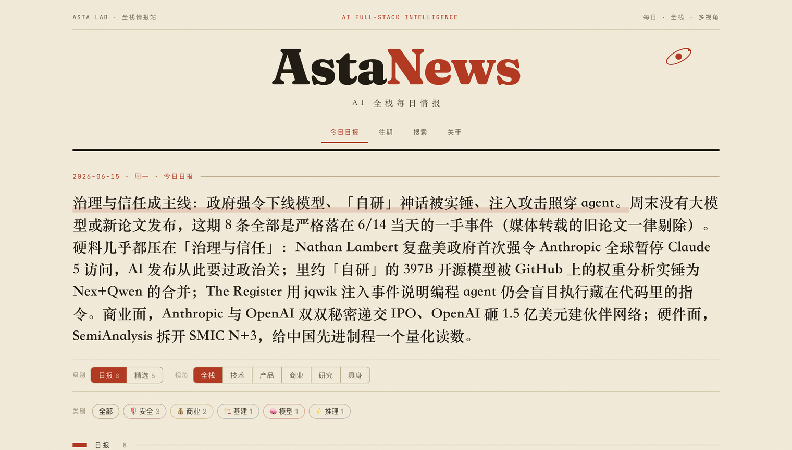

<div align="center">

# AstaNews

**AI 全栈每日情报** —— 每天从 121 个一手源里，策展出真正值得读的 5 条。

<sub>Daily, full-stack AI intelligence. Curated down from ~450 candidates to a handful that matter — papers, releases, evals, infra, agents, embodied, safety, business.</sub>

[](https://astalab.github.io/AstaNews/)
[](https://github.com/AstaLab/AstaNews/actions/workflows/daily-digest.yml)
[](https://github.com/AstaLab/AstaNews/actions/workflows/deploy-pages.yml)
[](#安装)
[](asta-news/sources/)

[**在线阅读**](https://astalab.github.io/AstaNews/) · [工作原理](docs/ARCHITECTURE.md) · [安装](#安装) · [贡献数据源](#贡献数据源)

<br>

<a href="https://astalab.github.io/AstaNews/"></a>

</div>

---

每天有 400 多条 AI 新闻冲进时间线，但真正推进领域的可能只有 5 条。AstaNews 把"从一手源里挑出这 5 条"做成一条**自动漏斗**：121 个已验证的一手源 → 去重 → 分类预排 → 由 agent 按编辑准则策展 → 多视角呈现成一份每天更新的情报站。

不是聚合器（堆得越多越好），而是策展器（**宁缺毋滥**）。论文看 arXiv 提交日、发布看 release 日、事件看发生日——媒体把几周前的旧工作重新包装成"今日热点"，这里一律剔除。

## ✨ 特性

- **🎯 层层筛选** —— 同一批候选筛成 **精选（5–8 条，最严）** 与 **日报（约 20 条，覆盖长尾）**，数量可配。
- **🔭 多视角 × 多类别** —— 6 个视角（全栈 / 技术 / 产品 / 商业 / 研究 / 具身，重排导语）× 13 个 stack layer 类别（硬筛），任意组合。
- **✍️ 多档犀利度** —— 中性新闻体 / 锐评 / 深读，一键切换；每条诚实标注保留意见，不丢任何数字。
- **🖼️ 用图说话** —— 精选自动配信息图（评测图 / 架构图），其余配源站题图。
- **🔍 可搜可订** —— 跨语言语义检索 + 关键词；每条带"相关新闻"（向量近邻）；Atom 订阅 + 社交分享卡。
- **🤖 全自动** —— GitHub Actions 每日产出并部署 Pages，仓库就是部署单元，零运维。

## 🗞️ 工作原理

```
121 一手源 ──抓取──▶ ~450 候选 ──去重──▶ 分类·预排 ──编辑策展──▶ 精选 5–8 条
   论文/发布/评测       并发·容错        仓库即状态     四维评分+约束     覆盖 ≥3 个 layer
```

确定性的活（抓取、解析、去重、分类、预排）交给零安装的 Python 脚本，要的是稳定和便宜；需要判断的活（核实、裁决、撰写）交给 agent。两层之间用结构化数据交接，互不污染。完整设计、每条工程取舍与踩过的坑见 **[docs/ARCHITECTURE.md](docs/ARCHITECTURE.md)**。

底层组成：一个 Claude Code plugin（编排，`asta-news/`）+ 一个 Next.js 静态站（`web/`）+ 一个可选的 FastAPI 后端（`services/`，本地全功能控制台）。一条命令体检全平台：`uv run asta-news/scripts/doctor.py`。

## 安装

```bash
# marketplace（推荐）
/plugin marketplace add AstaLab/AstaNews
/plugin install asta-news@asta-lab

# 本地开发
claude --plugin-dir ./asta-news
```

首次先运行 `/asta-news:setup`：初始化数据目录、探测网络代理、（可选）部署 RSSHub 以接入 X、Anthropic、GitHub Trending 等没有原生 feed 的源。这是一次性的，之后日常只需 `/asta-news:daily-digest`。

| Skill | 用途 |
|---|---|
| `/asta-news:daily-digest` | 生成当日 digest：抓取 → 去重 → 评分 → editor 裁决 → 归档发布 |
| `/asta-news:setup` | 初始化与健康检查：数据目录、代理、可选 RSSHub |
| `/asta-news:manage-sources` | 加 / 删 / 测数据源，调整规则，维护兴趣画像 |

## ⏱️ 自动化部署

仓库即部署单元，Pages 已上线。`.github/workflows/daily-digest.yml` 每天 UTC 01:00（北京 09:00）跑一期，把产物 commit 进 `site/data/` 与 `editions/`；`deploy-pages.yml` 在产物变化时自动部署。去重用"仓库即状态"——读历史 `site/data/*.json` 重建已见集合，无本地依赖、可重放、可 diff。

要让定时 digest 真正跑起来，只差一个密钥（用 **API URL + Key** 跑 Claude Code，不是 OAuth）：

```bash
gh secret set ANTHROPIC_API_KEY  --repo AstaLab/AstaNews              # 必填
gh secret set ANTHROPIC_BASE_URL --repo AstaLab/AstaNews              # 可选：自建/中转 endpoint
gh variable set ANTHROPIC_MODEL  --repo AstaLab/AstaNews --body "claude-fable-5"   # 可选
```

> GitHub runner 在墙外，被墙的源直连即可（无需代理），数据覆盖反而比本机更全。新鲜度按"上一期 → 这一期"接续判定，漏跑的天会自动补齐而不会补发旧闻。

## 贡献数据源

- **进默认注册表**：改 `asta-news/sources/*.yaml` 提 PR。schema 与验收标准见 [`_schema.md`](asta-news/sources/_schema.md)；PR 前必须 `uv run asta-news/scripts/probe_source.py --url <url>` 通过（可达性 + 新鲜度），并在 `notes` 标注验证日期。
- **只想自己用**：`/asta-news:manage-sources` 写入本地 `sources.local.yaml`，不动仓库。
- **调编辑规则**：全局默认在 `asta-news/rules.yaml`（走 PR）；个人口味在本地 `rules.local.yaml`。
- PR 自动跑校验（`validate_registry.py`：id 唯一 / layer / type / parser / 必填字段），本地先跑一遍更稳。
- 已知坑（停更的僵尸 feed、bot 墙站点、需过滤的刷屏源等）统一记录在 `_schema.md`，加源前先查表。

## 🌐 网页

[`astalab.github.io/AstaNews`](https://astalab.github.io/AstaNews/) 是 Next.js 静态站（`web/`，静态导出 → Pages）。视角 × 类别任意组合，精选配信息图，每条带"相关新闻"，搜索页支持语义 + 关键词。数据来自 `site/data/<date>.json`（digest 产物，唯一事实源）。

```bash
cd web && npm install && npm run dev     # 本地预览 http://localhost:3000
# 静态构建：npm run build → out/（GitHub Actions 自动构建部署）
```

## 📁 仓库结构

```
asta-news/                  # Claude Code plugin（编排）★ 核心
├── sources/*.yaml          #   源注册表（121，社区 PR 改这里）
├── config/                 #   模块化配置：tiers / perspectives / sharpness / site / search …
├── scripts/                #   fetch · dedup · classify · prerank · probe · doctor · embed · publish …
└── skills/                 #   daily-digest · setup · manage-sources
web/                        # Next.js 静态站（→ Pages）★ 站点本体
services/                   # FastAPI 控制台后端（语义检索 / 配置 / 触发 / 公众号 HTML）
site/data/<date>.json       # 每日产物（网页数据，唯一事实源）+ vectors / related / feed
editions/<date>.md          # 可读归档（可发公众号 / 群）
docs/                       # ARCHITECTURE（设计与数据流）· ROADMAP（PRD + backlog）
.github/workflows/          # daily-digest（生产）· deploy-pages · validate（贡献门）
```

<div align="center"><sub>Built with <a href="https://claude.com/claude-code">Claude Code</a> · 一份每天都值得点开的 AI 情报</sub></div>
